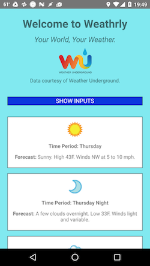

Weathrly in React Native

This is a rebuild of my [Weathrly](https://github.com/gness1804/weather-app-real-api) app in React Native. This app allows the user to enter a US city and state or a US Zip code and see an extended forecast for that city. (The app presently only works for the United States.) The user can toggle between these two input modes and can also show or hide the input view.

I built this app for Android, and it currently only works on this platform.

To use this app:

* Clone down this repo.
* `npm install`
* Make sure that [your system is set up to run Android apps on React Native](https://facebook.github.io/react-native/docs/getting-started.html).
* Once everything is set up, run `react-native run-android` when you are in the project directory.

The data for this app comes from the [Weather Underground API](https://www.wunderground.com/weather/api)
